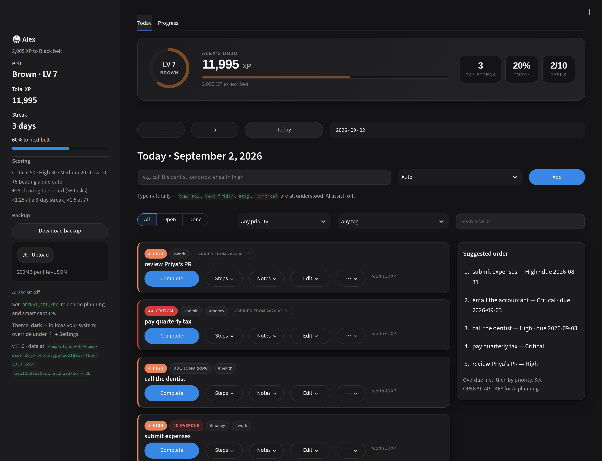
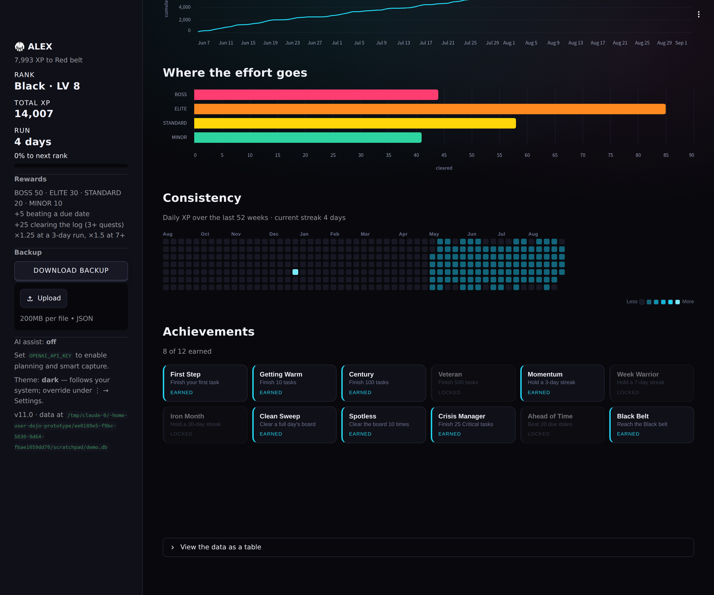

# Dojo

A quest log that keeps score. Clear quests, earn XP, climb the belts.

Built with Streamlit and SQLite. Single user, runs locally, no account needed.
Neon-arcade skin, dark by default — it follows your system theme, and you can
override it under ⋮ → Settings.





## Run it

```bash
pip install -r requirements.txt
streamlit run app.py
```

Data lives in `~/.dojo/dojo.db`. Point `DOJO_DB` somewhere else if you'd rather:

```bash
DOJO_DB=./dojo.db streamlit run app.py
```

## What it does

**Capture.** Type a quest the way you'd say it and the fields get filled in:

```
call the dentist tomorrow #health !high
file taxes by 2026-09-15 !critical #admin #money
renew passport in 3 weeks #admin
```

`!critical` `!high` `!medium` `!low` (and `!c` `!h` `!m` `!l`) set priority,
`#tag` adds tags, and dates understand `today`, `tomorrow`, `friday`,
`next monday`, `in 3 days`, `in 2 weeks`, `sept 20` and `2026-09-15`.
This all runs locally with no API key.

**Score.** Clearing a quest pays out XP. Difficulty tiers are a display layer
over the stored priorities, so old data keeps working:

| Tier | Rank | Stored priority | Base XP |
|---|---|---|---|
| BOSS | S | Critical | 50 |
| ELITE | A | High | 30 |
| STANDARD | B | Medium | 20 |
| MINOR | C | Low | 10 |

Plus **+5** for beating a due date and **+25** for clearing a full day's board
(3 or more tasks), and a streak multiplier of **×1.25** at 3 consecutive days,
**×1.5** at 7 or more. Each card shows what it's worth before you click.

Lifetime XP maps to belts — White, Yellow, Orange, Green, Blue, Purple, Brown,
Black, Red, Grandmaster — and there are 12 achievements to collect.

**Game feel.** Clearing a quest erupts a `+N XP` burst out of the HUD's XP bar.
Crossing a belt threshold opens a rank-up takeover. The HUD carries a rank
crest, a shimmering XP bar and a streak flame that burns harder the longer your
run. Buttons are pressable — they depress onto their own shadow. All of it
respects `prefers-reduced-motion`.

Reopening a task takes its XP back, and the clean-sweep bonus is recomputed
whenever the board changes, so the ledger always matches what's on screen.

**Organise.** Due dates, tags, objective checklists, notes, and filters by
status, tier, tag or free text. Unfinished work from previous days is moved
onto today automatically, once per day, tagged with where it came from.

**Review.** The Record tab charts quests cleared per day, cumulative XP, where
your effort goes by tier, and a year-long consistency calendar — plus a table
view of the same numbers.

## AI assist (optional)

Everything above works without it. Set an API key to turn on smarter capture,
subtask suggestions, and a "Plan my day" coach that sequences your board:

```bash
export OPENAI_API_KEY=sk-...
```

or put it in `.streamlit/secrets.toml`:

```toml
OPENAI_API_KEY = "sk-..."
```

`OPENAI_MODEL` overrides the model (default `gpt-4o-mini`). Anything the model
can't be reached for falls back to the local parser — the app never blocks on it.

## Backup

The sidebar downloads a full JSON export and restores one. Backups written by
the older `session_state` version of this app import too.

## Layout

```
app.py                 entry point, sidebar, routing
dojo/config.py         tiers, XP rules, belts, validated palettes
dojo/db.py             SQLite storage, XP ledger, carry-over, import/export
dojo/gamify.py         XP preview, belt progress, achievements
dojo/nlp.py            local natural-language task parser
dojo/ai.py             optional LLM assist, degrades gracefully
dojo/ui/theme.py       design tokens and the neon-arcade CSS
dojo/ui/components.py  HTML/SVG components (HUD, heatmap, tier chips, crest)
dojo/ui/board.py       the quest log
dojo/ui/stats.py       charts and history
tests/test_dojo.py     unit tests
```

## Tests

```bash
pip install pytest && python -m pytest tests/ -q
```

## Branches and staging

One repository, two branches:

| Branch | Role |
|---|---|
| `main` | production — whatever the live app deploys from |
| `claude/dojo-prototype-ui-features-f4xmhu` | staging — new work lands here first |

Nothing goes straight to `main`. The loop is:

1. Push the change to the staging branch.
2. CI runs on that push: unit tests, a byte-compile of every module, and an
   import check of the non-UI modules. Red means don't merge.
3. Click through the staging app (see below) to eyeball anything CI can't
   judge — layout, colour, animation.
4. Open a PR into `main` and merge once it's green.

`main` stays a known-good state you can always fall back to.

### A staging URL

Deploy a **second** Streamlit Community Cloud app from the staging branch, with
its own subdomain (e.g. `dojo-staging`). Repository and branch are fixed at
deploy time and can't be edited afterwards, so the two apps stay pinned to
their own branches: production follows `main`, staging follows the staging
branch. Each redeploys itself when its branch is pushed.

## Colour

The tier ramp and the belt colours are checked, not eyeballed:

* Tiers pass CVD separation, normal-vision separation and 3:1 contrast against
  the dark card surface as a categorical set. They sit deliberately above the
  usual dark-mode lightness band — being bright is the point of neon — and each
  tier always ships its rank letter and label, so hue is never the only channel
  carrying meaning.
* Every belt colour clears 4.5:1 on the dark surface. The higher ranks use
  their sheen rather than their literal dye, because a black belt rendered
  `#000` is invisible on a near-black page.
